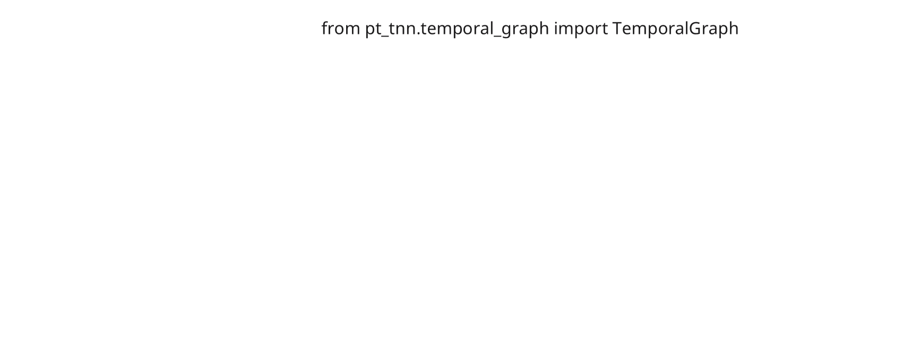
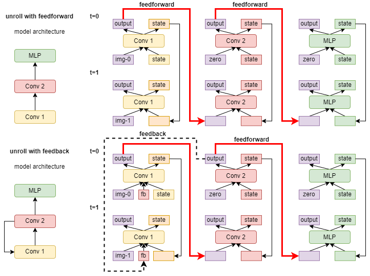
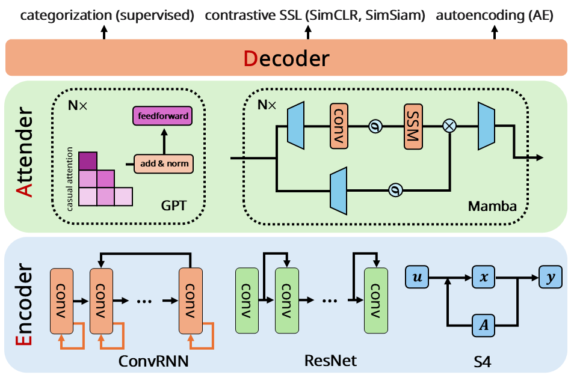

# `PyTorchTNN`: A PyTorch package for developing biologically-plausible temporal neural networks

The goal of this package is to provide a relatively easy-to-use set of functions to develop your own temporal neural networks (TNNs) in PyTorch.  The implementation of TNNs in PyTorch was adapted from the original convolutional recurrent neural network (ConvRNN) implementation in Tensorflow (see [here](https://github.com/neuroailab/convrnns), which includes our *ImageNet-pretrained* ConvRNNs).  The development of this package is an ongoing effort and we welcome contributions from the community aimed not only at increasing functionality, but also at improving usability.

**Check out the Colab notebook tutorial [here](https://colab.research.google.com/drive/11QuXuIwmAA_ULFHQ1QCRued1DObuyK0r).**

We visualize below how a temporal neural network (TNN) is constructed, unrolled using PyTorchTNN, and how TNNs can serve as a component of the Encoder-Attender-Decoder (EAD) architecture proposed in our [tactile-whisking](https://arxiv.org/abs/2505.18361) paper. 


## Components of temporal neural networks

### Conceptual overview

Temporal neural networks (TNNs) are neural networks that incorporate local recurrence or global skip and feedback circuits.  They can therefore capture information processing over sequences of inputs (e.g., sequences of images).  One key difference between these TNNs and typical recurrent neural networks is biological unrolling (see, e.g., [Nayebi\*, Bear\*, Kubilius\* et al., 2018](https://proceedings.neurips.cc/paper/2018/file/6be93f7a96fed60c477d30ae1de032fd-Paper.pdf)).  Specifically, a single time step is *not* associated with a full feedforward pass through the network, but rather, a single feedforward layer’s processing.  In this setup, the next timestep would be associated with the *subsequent* feedforward layer processing the output of its preceding layer.

Below, is a schematic of how this biological temporal unrolling occurs for an architecture that is purely feedforward (upper panel) and for an architecture that consists of a single feedback connection (lower panel).  Note that information processing for a single timepoint is described by each row in the schematic.  




### Terminology

To use this package, there are a few major components to define and to understand.  The three components are: harbor policy, pre- and post-memory, recurrent cell, and the temporal graph.  The harbor policy, pre-memory, recurrent cell, and post-memory (in that order) all constitute a single layer in the TNN architecture.  All of those components are combined together and instantiated in the `RecurrentModule` class, found [here](https://github.com/neuroagents-lab/PyTorchTNN/blob/main/pt_tnn/recurrent_module.py).

#### Harbor policy

The function of the harbor policy is to determine how to combine inputs to a particular layer.  For example, the input to a particular layer could come from feedback from a downstream layer, or from an upstream layer (e.g., the preceding layer or a skip connection).  The input could also include the stimulus itself (e.g., an image).  Currently, all the inputs to a given layer are combined using the `ResizeConcat` operation.  This operation resizes all the inputs to a layer according to the layer’s input shape and concatenates all the inputs along the channel dimension.  See [here](https://github.com/neuroagents-lab/PyTorchTNN/blob/main/pt_tnn/harbor_policy/resize_concat.py) for its implementation.

#### Pre- and post-memory

The pre- and post-memory modules effectively define the operation that the layer will perform.  Such operations could include (and is not limited to) a convolutional layer (i.e., basic 2D convolution on the preceding layer’s output), a pooling layer, or a residual add layer (i.e., a ResNet block).  The output of the pre-memory module would be fed into a memory module, which combines the output with the memory state from the previous timestep.  The output of the post-memory module would be fed into the next layer.  See [here](https://github.com/neuroagents-lab/PyTorchTNN/blob/main/pt_tnn/pre_post_memory/convolution.py), for example, for the implementation of a basic convolution operation for the pre-/post-memory module.

#### Recurrent cell

The recurrent cell module is the component of a layer that maintains a “memory” of its inputs and history (i.e., state) over time.  This component therefore determines how the current state of the module is combined with the input to the module at a particular timepoint.  There are many different kinds of recurrent cell architectures.  For example, you can use a vanilla recurrent cell (i.e., basic recurrent neural network), or you can use other recurrent circuits including the gated recurrent unit (GRU) or the long short-term memory (LSTM), among others.  Several recurrent cell motifs have already been implemented and can be found [here](https://github.com/neuroagents-lab/PyTorchTNN/tree/main/pt_tnn/recurrent_cells).

#### Temporal graph

This is the main component that builds the computation graph (i.e., the unrolling of operations over time), found [here](https://github.com/neuroagents-lab/PyTorchTNN/blob/main/pt_tnn/temporal_graph.py).  In this class, the `forward` function defines how the graph is constructed (i.e., unrolled over `n_times` timesteps).  In the first time step (i.e., `t == 0`), the input to every node (*except* nodes that receive stimulus input) is initialized as an all-zeros tensor.  All the inputs to each node are combined into a list which are then fed into the node’s recurrent module, which, as you may recall, includes the harbor policy, the pre-memory, the recurrent cell, and the post-memory.

## Package usage

To use `PyTorchTNN` to develop and to train your own temporal neural networks (TNNs), there are a few key steps to perform before you can start model training.  First, you must define your TNN architecture using a configuration file.  Next, you need to instantiate the temporal graph using the configuration file as input.  Finally, you feed in the input (e.g., a sequence of video frames) along with the number of timesteps to unroll to the temporal graph.

### Defining your temporal neural network architecture

Each TNN is defined by a configuration `.json` file.  See [here](https://github.com/neuroagents-lab/PyTorchTNN/blob/main/configs/test_resnet18_bn_timevary.json) for an example of how ResNet-18 can be constructed using the `PyTorchTNN` structure.  The json file consists of the keys: `nodes`, `edges`, `input_nodes`, `output_node`, `input_shape`, and `num_timesteps`.  Since ResNet-18 does not have any form of recurrence in it, each node’s `recurrent_cell` is defined to be `IdentityCell` (i.e., a “do nothing” operation).

Here we provide additional details for each key in the TNN architecture configuration `json` file:

* For the key `nodes`, the value is a list of modules, each of which has a `name` (the node’s name), `shape_from` (the input node that determines the given node’s input shape), `harbor_policy`, `pre_memory`, `recurrent_cell`, `post_memory`, `out_channels` (the number of features for the node, omitting the spatial dimensions), and `residual` (whether or not the module is a residual block).  
* For the key `edges`, the value is a list of dictionaries, each consisting of two items: `from` and `to`.  Each entry in the list describes which node connects to which node.  Note that you can also define a feedback connection.  
* For the key `input_nodes`, the value is a list defining which nodes receive stimulus input.  Nodes that are not in this list mean that they will receive an all-zeros tensor as input at timestep zero.  
* The key `output_node` defines which node provides output for, e.g., classification logits.  
* The key `input_shape` defines the dimensions of the inputs at each timesteps to the model.  
* The key `num_timesteps` defines the number of timesteps for which the model will be unrolled.

### Instantiating the temporal graph

Instantiating the graph is the same as instantiating any other object.  Here is a code snippet that instantiates the temporal graph:

```python
temporal_graph_resnet18 = TemporalGraph(
    model_config_file="configs/test_resnet18_bn_timevary.json",
    input_shape=[3, 224, 224],
    num_timesteps=10,
    transform=None
)
```

In this example, we are instantiating a temporal graph using the ResNet-18 configuration file, an input shape of (3, 224, 224\) (i.e., ImageNet training setup), and unrolling it for 10 timesteps.  The argument `transform` is a `Callable` that defines the input transformations (e.g., normalization).  By default, it is set to `None`, meaning that no transformation will be performed on the input. 

Note that we set the batch normalization in our ResNet-18 configuration to be time-varying, meaning that each layer at each time-step will have its own batch normalization. We recommend such a setup for architectures with batch normalization, as it prevents different unrolling time steps of the same layer interfering with the weights in batch normalization.

### Unrolling the model in time

Finally unrolling the model in time is much like a forward call you would perform on any other PyTorch model.  Here is an example piece of code to do so on a random input:

```python
# Define the input tensor
batch_size = 5
num_timesteps = 10
input_shape = [3, 224, 224]
random_input = torch.rand((batch_size, num_timesteps,) + tuple(input_shape))

# Forward pass
output, activations = temporal_graph_resnet18(
      random_input,
      n_times=10,
      return_all=True,
      return_activations=True
)
```

`temporal_graph_resnet18` was defined in the previous section and this piece of code calls the forward function of `temporal_graph_resnet18` on the `random_input` and unrolls the graph for 10 timesteps.  The `return_all` parameter determines whether or not to return the output (i.e., output from the `output_node`) or the activations from *all* the timesteps.  The `return_activations` parameter determines whether or not to return the output of each layer at each timepoint as a dictionary of `{t: {node_name: output}}`, where `t` is a timepoint (i.e., there will be `n_times` entries in this dictionary and the value for each timepoint is a dictionary with the number of items equal to the number of nodes in the graph).

### Currently supported RNNs
The following RNNs are supported by PyTorchTNN under [recurrent_cells](https://github.com/neuroagents-lab/PyTorchTNN/tree/main/pt_tnn/recurrent_cells).
- [GRU](https://arxiv.org/pdf/1412.3555)
- [LSTM](https://ieeexplore.ieee.org/abstract/document/6795963)
- [TimeDecay](https://proceedings.neurips.cc/paper/2018/file/6be93f7a96fed60c477d30ae1de032fd-Paper.pdf)
- [UGRNN](https://arxiv.org/pdf/1611.09913)
- [IntersectionRNN](https://arxiv.org/pdf/1611.09913)
- [ReciprocalGatedCell](https://proceedings.neurips.cc/paper/2018/file/6be93f7a96fed60c477d30ae1de032fd-Paper.pdf)
- [vanilla RNN](https://github.com/neuroailab/convrnns/blob/master/convrnns/utils/cells.py#L248-L327)
## Training a temporal neural network

We demonstrate how to train a TNN on ImageNet. Specifically, we choose the [ReciprocalGatedCell](https://proceedings.neurips.cc/paper/2018/file/6be93f7a96fed60c477d30ae1de032fd-Paper.pdf) as the recurrent module, and train a [6-layer TNN](https://github.com/neuroailab/convrnns/blob/master/convrnns/models/rgc_shallow.json) unrolling for 16 time steps.

We first specify the TNN model as follows, where we set `transform` as `MakeMovie`, which inserts blank images after a certain time step. In order to support residual, feedback connections for the ReciporcalGatedCell, we use a customized `RecurrentModuleRGC` for the `recurrent_module` when constructing the TNN. 

Note that to support flexibility for the recurrent cells in TNN, we can pass in a customized `recurrent_module` (default is None, which will use the default recurrent cell in PyTorchTNN). 

```python
model_config_file = 'configs/test_rgc_shallow.json'
input_shape = [3, 224, 224]  # specify the input shape (C, H, W)
num_timesteps = 16
transform = MakeMovie(times=num_timesteps, image_off=12)

TG = TemporalGraph(model_config_file=model_config_file,
                  recurrent_module=RecurrentModuleRGC,
                  input_shape=input_shape,
                  num_timesteps=num_timesteps,
                  transform=transform)
```

We create the model and data loader using PyTorch Lightning as follows, with specified learning rate, batch size, number of classes to classify, and input shapes of the image.

```python
tnn_model = TNNModel(model=TG, n_times=num_timesteps, lr=lr, num_classes=1000, input_shape=input_shape)
data_module = ImageNetDataModule(batch_size=batch_size, num_workers=32)
```

The training is defined as follows with PyTorch Lightning, and we omit some parts of the parameters for clarity. We provide the full training script in [`train_ptnn_on_imagenet.py`](https://github.com/neuroagents-lab/PyTorchTNN/blob/main/train_ptnn_on_imagenet.py)

```python
# Callback to save the last training checkpoint
last_ckpt_callback = ModelCheckpoint(...)

# Define the checkpoint callback
val_ckpt_callback = ModelCheckpoint(...)

trainer = pl.Trainer(
   strategy=DDPStrategy(find_unused_parameters=False),
   callbacks=[last_ckpt_callback, val_ckpt_callback],
   logger=logger,
   max_epochs=100,
   enable_progress_bar=True,
   check_val_every_n_epoch=1,
   devices=num_devices,  # or 0 if you're using CPU
   gradient_clip_val=1.0,
)

trainer.fit(model=tnn_model, datamodule=data_module)
```

## Encoder-Attender-Decoder (EAD) architecture

We introduce the Encoder-Attender-Decoder (EAD) architecture, as illustrated in the figure below, where the encoder, attender, and decoder sequentially process the input, and can be configured and implemented by different kinds of models. 




We provide a simple realization of the EAD architecture below, where the encoder, attender, and decoder are implemented by the TNN model (unrolled ResNet-18), self-attention, and a linear layer. The full implementation is provided in [`EAD_example.py`](https://github.com/neuroagents-lab/PyTorchTNN/blob/main/EAD_example.py). For more details on the EAD architecture, **please refer to our [tactile-whisking](https://github.com/neuroagents-lab/2025-tactile-whisking/tree/main/tactile-nn/tactile_model/enc_att_dec) codebase**.

```python
from EAD_example import TNNEncoder  # self-defined encoder in EAD_example.py
from EAD_example import SelfAttention  # self-defined attender in EAD_example.py
from EAD_example import LazyLinearDecoder  # self-defined decoder in EAD_example.py


class EncAttDec(nn.Module):
   def __init__(self, out_features, n_times=10):
       super(EncAttDec, self).__init__()

       self.encoder = TNNEncoder(n_times=n_times)
       self.attender = SelfAttention(embed_dim=1000,  # the output dimension of ResNet18 is 1000
                                     num_heads=8)
       self.decoder = LazyLinearDecoder(out_features=out_features)

   def forward(self, x, ):
       # encode, (bs, t, C, H, W) ---> (bs, t, d)
       x = self.encoder(x)
       # attend, (bs, t, d) ---> (bs, t, d)
       x = self.attender(x)
       # decode/predict, (bs, t, d) ---> (bs, num_classes)
       pred = self.decoder(x)
       return pred
```

We illustrate the forward pass of our simple EAD example with a batch size, unroll time steps, and number of classes of 3, 10, and 100, which will produce a prediction of shape (bs=3, out\_features=100)

```python
bs, T = 3, 10
random_input = torch.rand(bs, T, 3, 224, 224)
out_features = 100

model = EncAttDec(out_features=out_features,  # output dimension
   n_times=T  # number of unrolling steps in the TNN encoder
)
output = model(random_input)

print(output.shape)  # (bs, out_features)
```

## Using other standard neural networks
### Standard forward pass for ResNet-18
Besides biological unrolling, PyTorchTNN supports full forward pass in [TemporalGraph.full_unroll()](https://github.com/neuroagents-lab/PyTorchTNN/blob/main/pt_tnn/temporal_graph.py#L505), where all the layers will be activated at each time step. When the unrolling step is set to be 1, it is identical to the forward function defined in PyTorch. We demonstrate such usage with ResNet-18 as an example below.
```python
temporal_graph_resnet18 = TemporalGraph(
    model_config_file="configs/test_resnet18_bn_timevary.json",
    input_shape=[3, 224, 224],
    num_timesteps=1,
    transform=None
)

# Define the input tensor
batch_size = 5
input_shape = [3, 224, 224]
random_input = torch.rand((batch_size, ) + tuple(input_shape))

# One full unroll forward pass (equivalent to the standard forward pass defined in PyTorch)
output = temporal_graph_resnet18.full_unroll(
      random_input,
      n_times=1,
)

```
### Using different neural networks in EAD
To replace any component (e.g., use an encoder other than modules built by PyTorchTNN) in the EAD architecture, one can use customized modules or existing implementations/packages such as Transformers, SSMs (simple `import` examples shown below).
```python
from torch.nn import Transformer
from mamba_ssm import Mamba
```
## Contributors

| Name       | GitHub                                        | Contributions    |
|------------|-----------------------------------------------|------------------|
| Aran Nayebi | [@anayebi](https://github.com/anayebi)    | Ideas, Implementation of TNN in TensorFlow  |
| Nathan C. L. Kong | [@nathankong](https://github.com/nathankong)      | Implementation of PyTorchTNN, Documentation |
| Yuchen Shen  | [@A-Chicharito-S](https://github.com/A-Chicharito-S)      | Implementation of PyTorchTNN, Documentation |

## Citation
If you find our package useful/interesting, please consider citing our paper, thank you for your interest in our work!
```
@misc{chung2025tactile,
      title={Task-Optimized Convolutional Recurrent Networks Align with Tactile Processing in the Rodent Brain}, 
      author={Trinity Chung and Yuchen Shen and Nathan C. L. Kong and Aran Nayebi},
      year={2025},
      eprint={2505.18361},
      archivePrefix={arXiv},
      primaryClass={q-bio.NC},
      url={https://arxiv.org/abs/2505.18361}, 
}
```
